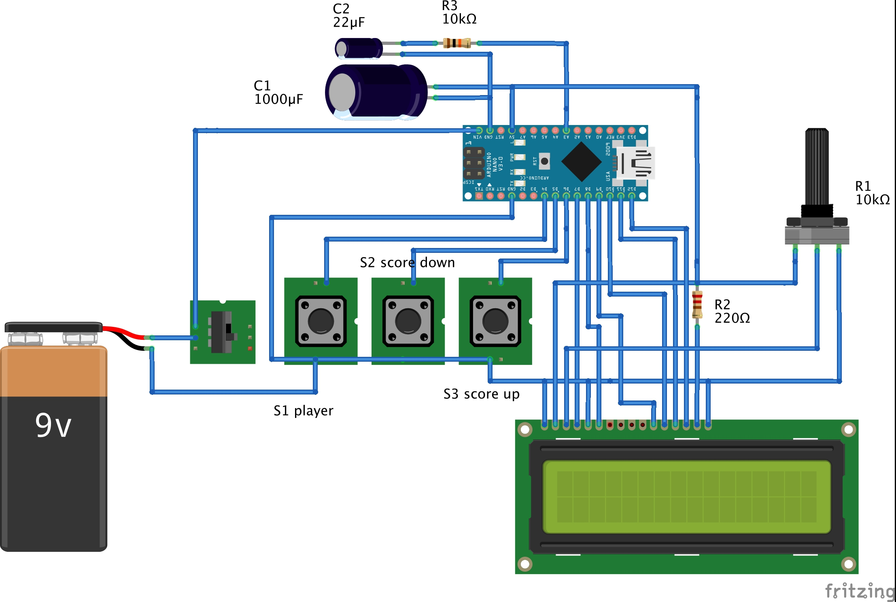

# Arduino-multi-player-score-tracker
Device for tracking multiple player's or team's score for games and activities.

Assume you are part of a game or activity with following requirements
- Multiple players or teams will be participating, don't know the count of players in advance.
- Each player or team will be earning  or losing points based on the rule of the game.
- Score of every  players  need to tracked using one device instead of multiple devices.
- Game or activity may span across days, option to store and retrieve score during breaks or even after days.
- Option to reset score of all players when you restart or reset  the game.
- Option to decide on increment and decrement step for the score.
- Game  is planned to happen outdoor (or indoor) with no access to power supply.

Multi Player Score Tracker (MPST)  explained here has the features to support all of the requirements listed above.

### Components required

1. Arduino nano or uno 
2. 16 x 2 LCD display - 1 no
3. Push button switch  - 3 nos (normally comes with Arduino kit)
4. 1000mf /16v capacitor - 1 no
5. 22mf / 16v capacitor - 1 no 
6. 10 kilo ohm resistor - 1 no
7. 200  ohm resistor - 1 no
8. 10 kilo ohms adjustable resistor - 1 no
9. 5 volt power supply (usb supply will do)
10. 9v battery - 1no (if you would like the unit to be powered by battery)

### Schematic diagram

### Wiring  diagram

### Program flow chart

### Description of the system

MPST is built with one Arduino (any variant) , one 16x2 LCD display, 3 push button switches and few other components. Different combinations of button strokes  are used for achieving various  operations. This unit can be powered by 5V USB supply or by 9V battery . While turning the device off score of all players  get stored in EEPROM for later retrieval and for resuming  game. On powering up the device  previously stored score get from EEPROM and can be resumed. As the number of components are minimal it can be assembled in a small box (please refer to prototype image) for easy handling. By powering it with 9V battery unit can  be taken for outdoor games as well. 

System can be operated and controlled  in 3 different modes with the help of 3 push buttons named ‘player’ , ‘score up’ and ‘score down’ buttons .  All 3  button’s status is scanned continuously to detect short press ,  long press and to decide on operation mode.
- **View score mode**  - This is the default mode, in this mode score of every player can be reviewed by just pressing ‘score up’ or ‘score down’ buttons. With every press of ‘up’ or ‘down’ buttons  system cycles through score of each player.
- **Update score mode** - This mode  is for score update operation. Just press ‘player’ button to enter into this mode. With every push of ‘player’ button system cycle through each player’s score update mode. ‘Up’ and ‘down’ buttons  are used for incrementing and decrementing score by the configured step value . To exit from this mode press and hold ‘player’ button for 2 secs.
- **Config mode** - Press and hold both ‘score up’ and ‘score down’ simultaneously  for 2 seconds to enter into this mode (make sure the first button to press is ‘score up’ followed by ‘score down’). There are 3 different configurable parameters, with every push of ‘player’ button  system cycle through following  3 configurable parameters.
  - _Number of players_ : This is the default option in config mode. Use ‘score up’ and ‘score down’ buttons to increment and decrement player count.
  - _Reset score ?_ : This is for resetting every players score to zero. Use ‘score up’ and ‘score down’ button to answer ‘YES’ or ‘NO’ to this question.
  -  _Score step_ : This is for setting incremental / decremental step for score while updating score. Minimum is 1 and it can be set to any integer number. Use ‘score up’ and ‘score down’ buttons to choose the number needed.
In order to exit from config mode press and hold ‘player’ button for 2 secs.

There is a 10ms timer configured with the help of MsTimer2 library.  Purpose of the timer function powerLossDetector() is to monitor the voltage level at A3 input and to keep C2 charged at a steady level. During power failure A3 input will show higher voltage level which will trigger EEPROM write operation to save all scores. High value capacitor C1 is a must for powering Arduino unit while writing data into EEPROM. 

### Code
Code is available here [here](Code/Multi_Player_Score_Tracker.ino)

### Prototype photos
Outside view of the assembled unit.

Inside view of the assembled unit.

